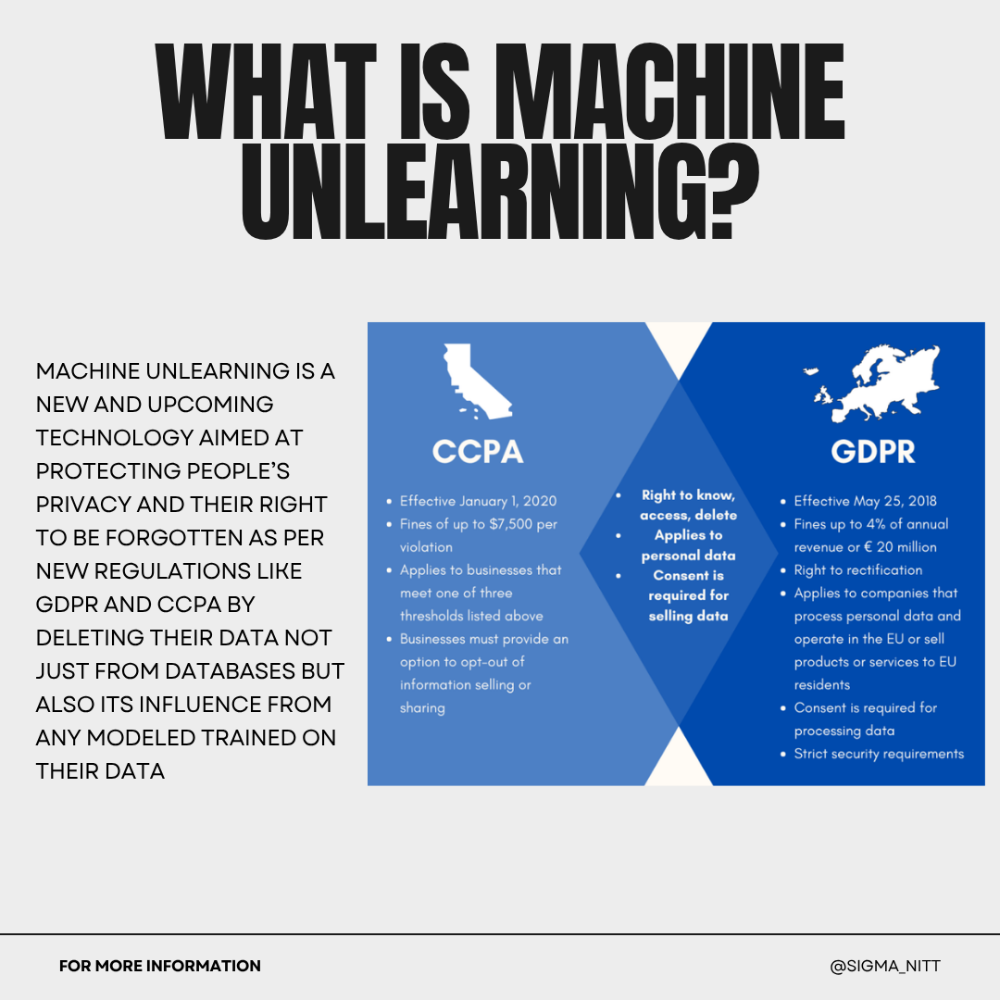
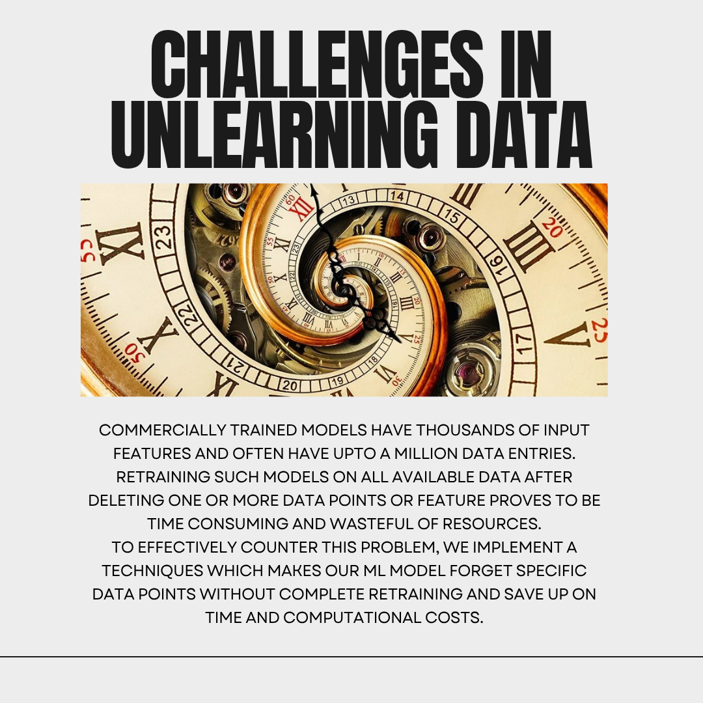
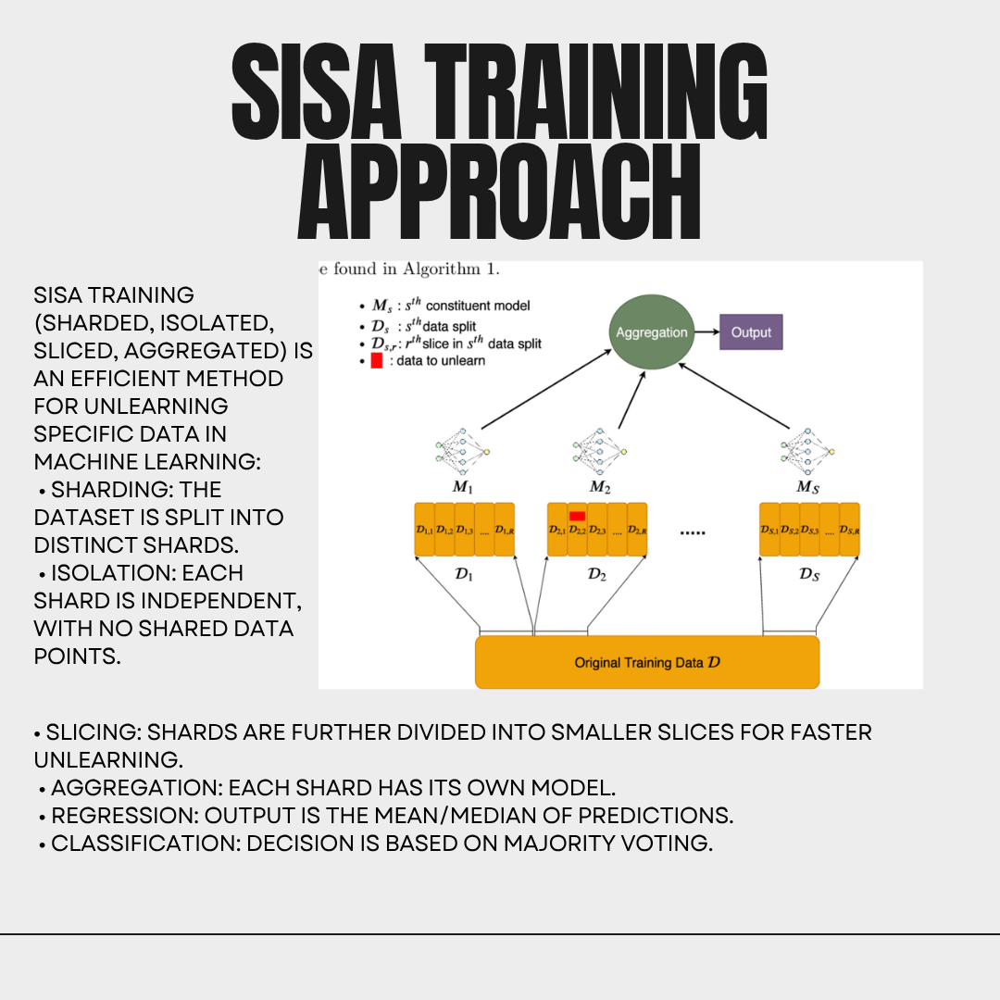
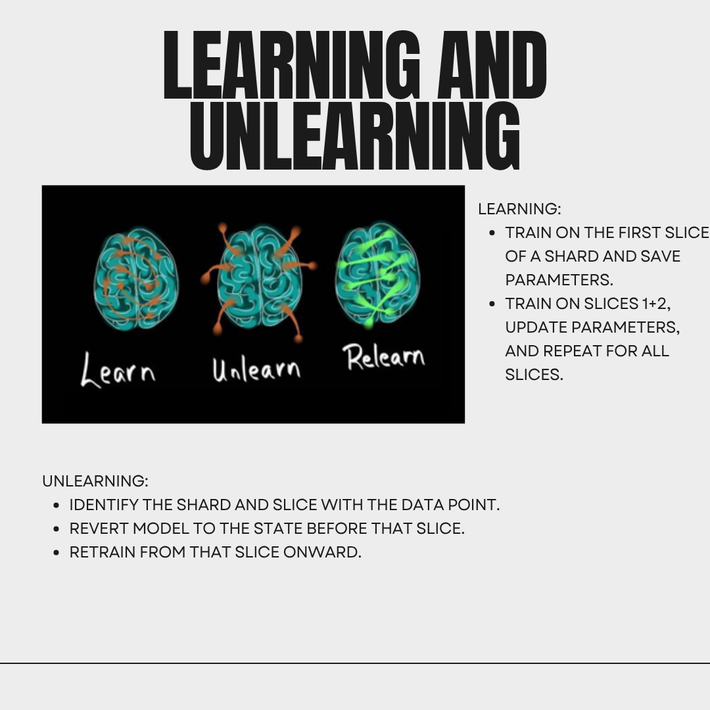

# Machine Unlearning using SISA Training (MUnL)

## Overview

This project implements a **Machine Learning pipeline for loan data prediction** using a deep neural network, and extends it with **SISA (Sharded, Isolated, Sliced, Aggregated) training** to enable **efficient machine unlearning**.

The goal is to:

* Train a predictive model on financial/loan data
* Partition training into shards and slices
* Efficiently remove specific data points without retraining the full model

---

## Key Features

* End-to-end ML pipeline (data → preprocessing → training → evaluation)
* Deep Neural Network built using **PyTorch**
* Implementation of **SISA training framework**
* Efficient **data deletion (machine unlearning)** mechanism
* Performance tracking using:

  * RMSE
  * Loss curves
  * Accuracy plots

---

## Results

### Output Visualizations

  

  

  

  

  

  

---

## Dataset

* Dataset: **FNMA Loan Data**
* Contains financial and demographic attributes such as:

  * Borrower income
  * Area median income
  * Loan purpose
  * Property type
  * Rate spread
  * Occupancy details

---

## Methodology

### 1. Data Preprocessing

* Feature selection from raw dataset
* Train-test split using `sklearn`
* Feature scaling using **StandardScaler**
* Conversion to PyTorch tensors

---

### 2. Baseline Model

A fully connected neural network:

* Input: 15 features
* Architecture:

  * Linear (15 → 512)
  * Linear (512 → 512)
  * Linear (512 → 64)
  * Linear (64 → 1)
* Activation: ReLU
* Regularization: Dropout (0.3)

---

### 3. Training

* Loss Function: **MSE Loss**
* Optimizer: **Adam**
* Batch training using DataLoader
* Metrics tracked:

  * Training & Test Loss
  * Accuracy (custom metric)
  * Error metrics (RMSE, MAPE)

---

### 4. SISA Training (Core Contribution)

The dataset is divided into:

* **Shards** → independent subsets of data
* **Slices** → sequential partitions within each shard

Each shard:

* Trains its own independent model
* Stores intermediate model states

Final prediction:

* Aggregated using **mean of shard outputs**

---

### 5. Machine Unlearning

To remove a data point:

1. Identify its **shard and slice**
2. Retrain only:

   * That shard
   * From the affected slice onward
3. Keep all other shards unchanged

This avoids full retraining → **major efficiency gain**

---

## Tech Stack

* Python
* PyTorch
* NumPy, Pandas
* Scikit-learn
* Matplotlib, Seaborn

---

## Future Improvements

* Optimize shard/slice selection strategy
* Add GPU acceleration
* Implement differential privacy
* Extend to classification tasks
* Build API for real-time unlearning

---

Machine unlearning is critical for:

* **Data privacy (GDPR compliance)**
* Removing biased or incorrect data
* Efficient model updates without retraining

This project demonstrates a **practical and scalable approach** using SISA.

---

## Author

Viraj Mankani
