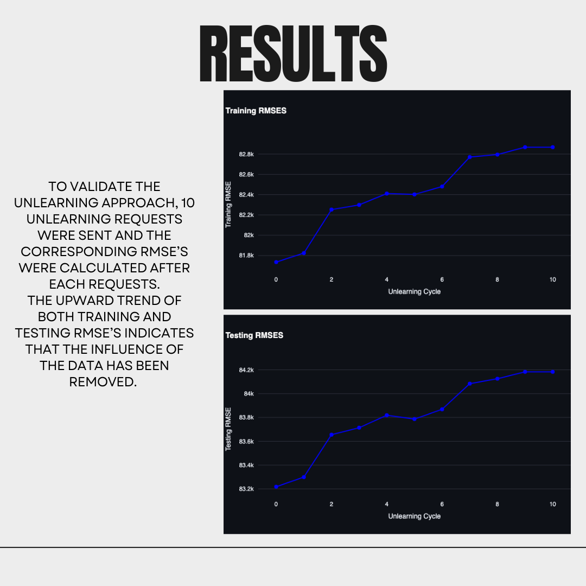

# Project Title

## Results

### Output Visualizations

<p align="center">
  
</p>

<p align="center">
  
</p>

<p align="center">
  
</p>

<p align="center">
  
</p>

<p align="center">
  
</p>

<p align="center">
  
</p>

---

## Description
Briefly describe what your project does here.

## How to Run
```bash
pip install -r requirements.txt
jupyter notebook
```

## Tech Stack
- Python
- Jupyter Notebook
